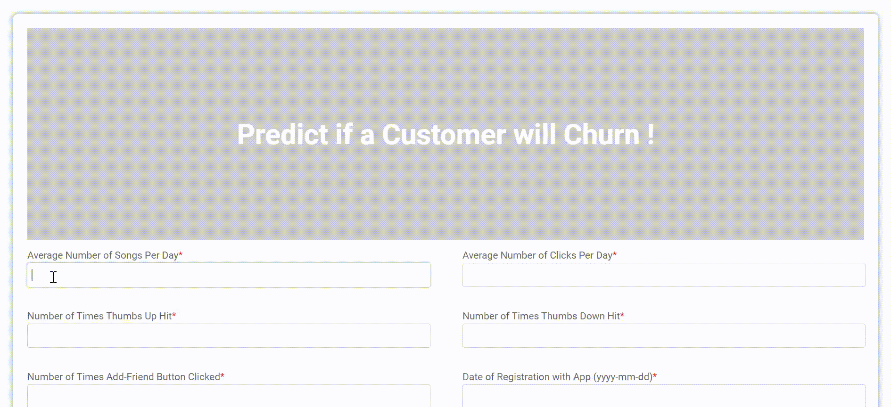

# Sparkify-Churn-Prediction-Pyspark

Machine Learning on a Large 12 GB dataset with Pyspark. The dataset is provided Udacity and the link to S3 bucket is given below:

*  [mini-sparkify-event-data (~150 MB)](s3n://udacity-dsnd/sparkify/mini_sparkify_event_data.json)
* [sparkify-event-data (~12 GB)](s3n://udacity-dsnd/sparkify/sparkify_event_data.json)

## About

### Project Overview

Predicting churn rates is a very challenging and common problem that data scientists and analysts
face in any customer-facing business. They have to ascertain it before so that steps can be taken to prevent users from churning. The goal of this project was to help Sparkify music 
service retain their customers.

The main task of the project is to make a prediction, whether the customer is about to churn. Such a prediction can be made for each customer by a binary classifier model. The following tasks should be completed 
to create the model: 
* Analyze and preprocess the data to extract usable features for each customer 
* Train classifier and then evaluate it

### Input Data

Data is the log of all activity on Sparkify. Two datasets are used

* sparkify_event_data.json – large dataset with 26 million records

* mini_sparkify_event_data.json – a tiny subset of the full dataset, which is useful for preliminary data analysis. 

Both files contain the following data:

|#| Column | Type | Description |
| --- | --- | --- | --- |
| 1 | userId | string | Unique identifier of the user|
| 2 | artist | string | Name of the artist related to the song related to the event |
| 3 | auth | string | authentication of the customer : whether he is logged in or not |
| 4 | firstName | string | First name of the user |
| 5 | gender | string | Gender of the user |
| 6 | itemInSession | bigint | Item in session |
| 7 | lastName | string | Last name of the user |
| 8 | length | double | Length of the song related to the event |
| 9 | level | string | Whether the account is free or paid. User can change the level, so events for the same user can have different levels |
| 10 | location | string | Location of the user |
| 11 | method | string | Get method or Put method |
| 12 | page | string | Type of action which corresponds to the event : this can be clicking "Next Song", "Upvoting" etc |
| 13 | registration | bigint | Registration |
| 14 | sessionId | bigint/long| Session id|
| 15 | song | string | Name of the song related to the event |
| 16 | status | bigint/long | Response status from the page: 200, 404, 307 |
| 17 | ts | bigint/long | Timestamp of the event |
| 18 | userAgent | string | The browser used and other relevant information eg: Mozilla/5.0 |

### Files and Folder Description

* churn-prediction.ipynb : Exploratory Data Analysis, Feature Engineering and Classification using the `mini-event-sparkify-data` on my local system.
* reference.ipynb : Feature Engineering and model training on AWS EMR with `mini-event-sparkify-data` with 1 m5.xlarge node cluster. This is used as a reference for training with large data.
* training-aws-emr.ipynb : Actual training on the large `event-sparkify-data` with 5 m4.xlarge node cluster
* run.py : script to run the flask application
* errors.py : script to handle errors in user input
* df_ml.xlsx : dataset engineered from `event-sparkify-data` which has 1 row of information per user. This is the data that is used for actual model training.
* requirements.txt : The dependencies for this application
* models : Saved models after training on large dataset on AWS EMR
* templates : html templates
* static : css styles

I recommend going through the files in the above order

## Implementation

The original data has 26 million rows that cannot be processes in a single machine. That is why I have used Spark clusters to analyze data and predict customer churn. I use PySpark and SparkML libraries to implement the solution. The implementation of the project consists of two parts:

* EDA, Feature Engineering and Machine Learning on the dataset
* Developing a flask based application for actual use case by people

## Demo



## Repository Structure

```
- app
| - templates
| |- form_css.html # home-page template
| - static 
| |- main.css # home-page style
|- run.py  # Flask application
|- errors.py # Handle Exception

- demo
|- gif.gif # animation with prediction of churn

- model
|- model-gbt # PySpark Gradient Boosted Trees model
|- model-rf # PySpark Random Forest model
|- model-gbt-one-hot-encoder-estimator # PySpark Gradient Boosted Trees model with OneHotEncoderEstimator instead of OneHotEncoder (This has been used in the application)
|- model-rf-one-hot-encoder-estimator  # PySpark Random Forest model with OneHotEncoderEstimator instead of OneHotEncoder

- README.md
- churn-prediction.ipynb # Python 3 notebook, which contains analysis of small dataset
- reference.ipynb # PySpark kernel notebook on AWS EMR, which contains analysis of small dataset
- training-aws-emr.ipynb # Pyspark kernel notebook on AWS EMR, which contains analysis of large dataset
- df_ml.xlsx # Extracted Dataset for triainig model
- requiremects.txt # Dependencies of this application


```

## Conclusion & Improvement

I tried training with two models Gradient Boosted Trees and Random Forest, and have got an F1 score of 80% which is good for actual use case. 


Some improvements that can be made are :

* Using cross-validation and param-grid-builder to find out the best parameters 
* Trying other models such as Neural Networks, Support Vector Machine etc
* Extracting out new features that can predict churn better
